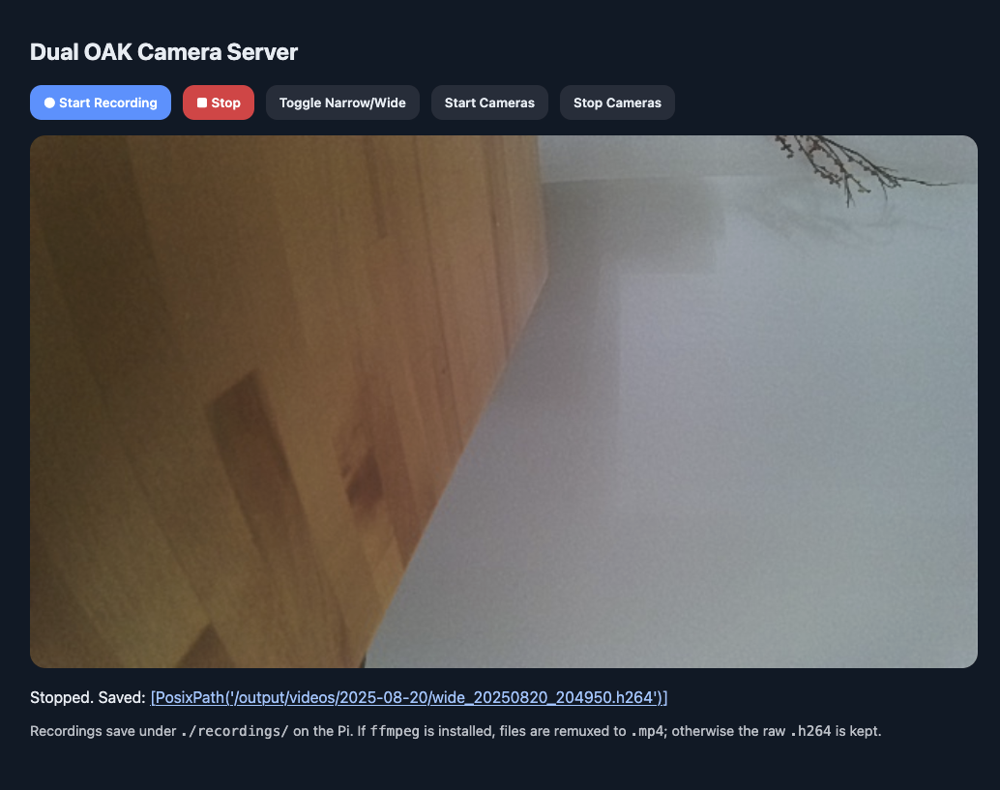

# OAK Dual Camera Server

A lightweight web server for streaming and recording video from two OAK (OpenCV AI Kit) cameras connected to a Raspberry Pi (or similar device). The server provides live low-latency previews and efficient H.264 recordings, with optional support for uploading recordings to S3-compatible storage. Made for Balena!

## Features

📹 Dual camera support (wide + narrow, or any two OAK devices)

🌐 MJPEG live streaming via web browser

🎥 H.264 recording with MP4 remuxing for efficient storage

☁️ S3 integration – automatically upload recordings to cloud storage

⚡ Dockerized setup for easy deployment

📶 WiFi Connect utility for headless device setup


## Project Structure

```bash
oak-dual-camera-server/
├── app.py                  # Flask entrypoint
├── docker-compose.yaml     # Multi-service deployment (server + uploader)
├── requirements.txt        # Python dependencies
├── src/rpi_dual_cam_server/cam_server.py  # Core camera handling
├── static/main.js          # Client-side streaming logic
├── templates/index.html    # Web UI
├── s3_upload/              # S3 uploader service
└── wifi-connect/           # WiFi Connect utility for device setup

```

## Installation

### 1. Clone the repository

```bash
git clone https://github.com/siddhi47/oak-dual-camera-server.git
cd oak-dual-camera-server
```

### 2. Install dependencies

USE pip to install the required Python packages:

```BASH
pip install -r requirements.txt
```

Or use uv

```bash
uv pip install -r requirements.txt
```

## Running the Server

```bash
python -m gunicorn app:app --bind 0.0.0:5000 -k gevent
```

## Deploy on Balena

```bash
balena deploy  <org-name>/<fleet-name> --build --nocache 
```

<strong> NOTE: You may need to modify docker-compose.yaml and Dockerfile.template files to run on local setup. </strong>
